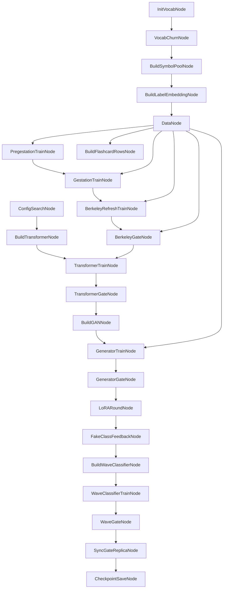

# meta-nn

`meta-nn` is the extracted training and orchestration workspace for a graph-shaped meta network: a set of cooperating nodes that build vocabulary, prepare data possessions, train staged models, gate progress, and feed later stages with the results of earlier ones.

The system is designed around explicit graph execution rather than a single monolithic training loop. Each node owns one concern, edges define when data is provisioned, and gate nodes decide whether downstream stages are ready to run.

## Design Overview

The pipeline is organized as a staged network of interacting nodes:

## Node Roles

- `InitVocabNode`: establishes the current term inventory and semantic target space.
- `VocabChurnNode`: mutates or refreshes vocabulary state on the configured churn schedule.
- `BuildSymbolPoolNode`: prepares symbol/image sources used by gestation-stage data building.
- `BuildLabelEmbeddingNode`: creates the embedding basis used for semantic conditioning and scoring.
- `DataNode`: the storage authority for wave pools, pregestation rows, gestation rows, Berkeley rows, and payloads; data is provisioned across edges on demand.
- `PregestationTrainNode`: trains the earliest synthetic stage on diversified pregestation passes.
- `GestationTrainNode`: advances training using symbol-pool and mixed-source gestation data.
- `BerkeleyRefreshTrainNode`: trains the Berkeley semantic stage against full-vocabulary image/mask data.
- `BerkeleyGateNode`: decides whether the semantic stage is strong enough to unlock later training.
- `ConfigSearchNode`: searches runtime/render/training configuration for viable operating points.
- `BuildTransformerNode`: materializes the transformer once configuration is accepted.
- `TransformerTrainNode`: learns sequence or feature transformations used by later stages.
- `TransformerGateNode`: evaluates whether transformer outputs justify proceeding.
- `BuildGANNode`: instantiates the conditional generator/discriminator pair.
- `GeneratorTrainNode`: trains the generator through adversarial and classifier-mediated semantic feedback.
- `GeneratorGateNode`: checks whether generator quality is good enough to continue.
- `LoRARoundNode`: applies parameter-efficient adaptation rounds against the current classifier state.
- `FakeClassFeedbackNode`: feeds generated samples back through the classifier path as semantic pressure.
- `BuildWaveClassifierNode`: constructs the waveform/image classifier used in the wave stage.
- `WaveClassifierTrainNode`: trains the wave classifier from rendered waveform records and labels.
- `WaveGateNode`: decides whether wave-side readiness criteria are met.
- `SyncGateReplicaNode`: synchronizes gate state and replica state for the next round.
- `CheckpointSaveNode`: persists runtime state, model state, and graph progress.
- `BuildFlashcardRowsNode`: emits payload rows and derivative examples for downstream inspection or study artifacts.

## Interaction Model

The key architectural rule is that nodes do not reach into one another ad hoc. Data is supplied when an edge is traversed. That means:

- topology lives in the orchestrator
- storage policy lives in `DataNode`
- training logic lives in stage nodes
- progression policy lives in gate nodes

This gives the meta network a clear separation between:

- what exists
- when it is built
- who consumes it
- whether later stages are allowed to run

## Repository Layout

- `pipeline/`: graph model, context, orchestrator, node implementations, protocol definitions, and utilities.
- `wav_ml_core.py`: waveform record, rendering, and basic audio utility functions.
- `wav_ml_models.py`: model definitions, training helpers, and runtime configuration helpers.
- `semantic_dataset_loaders.py`: Berkeley semantic data loading, degradation, mask construction, and dataset support.
- `wav_pipeline_graph.py`: graph-oriented entrypoint bridging the older monolith into the extracted pipeline structure.

## Current Intent

This repository is the isolated home for the meta-network effort. The immediate goal is to keep the graph-native training system moving independently of the original mixed C++ and Python workspace, so the network architecture, staged training flow, and data-node design can evolve on their own boundary.
